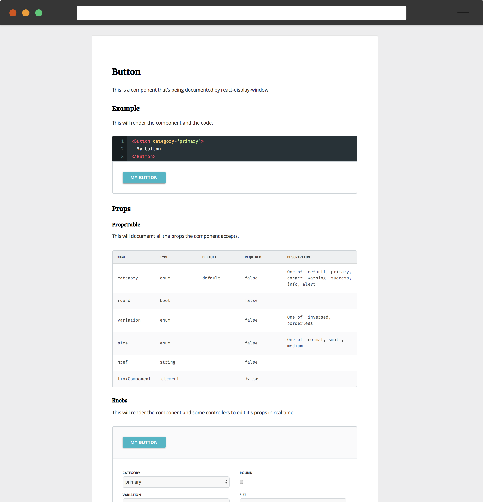
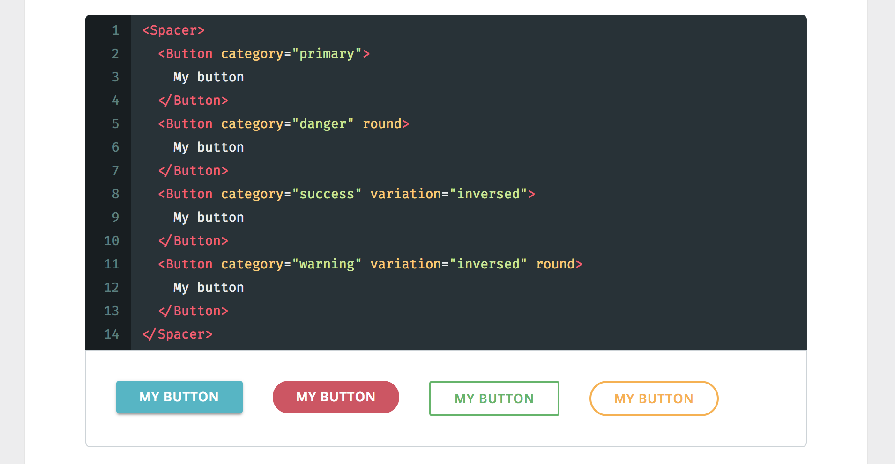
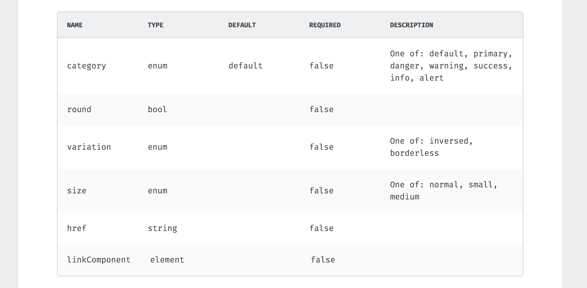
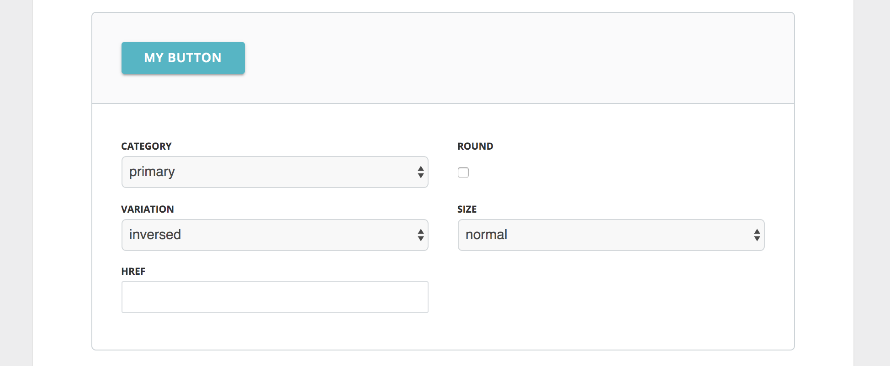

<div align="center" markdown="1">

</div>


# React Display Window


React Display Window is a simple tool to write documentation for when having a full guide is overkill. React Display Window is therefore best suited for one component libraries or libraries where all of the components are related.

It's also very useful during the development stage of these components libraries because it allows you to see the code working and running like in a real usage environment.


## Installation

Install it as any other dev dependency in your repo:

```bash
$ npm install --development react-display-window
```

## Usage

First we create an `.mdx` file which would contain the documentation of the project. You can use React and markdown inside this file.

```md
// my-component.mdx

import { PlayGround, Knobs, PropsTable } from 'react-display-window/lib/components';
import Button from './src';

# Button

This is a component that's being documented by react-display-window


## Example

This will render the component and the code.

<PlayGround>
  <Button category="primary">
    My button
  </Button>
</PlayGround>

## Props

### PropsTable

This will document all the props the component accepts.

<PropsTable component={Button} />

### Knobs

This will render the component and some controllers to edit it's props in real time.

<Knobs
  component={Button}
  defaults={{ category: 'primary' }}>
  <Button>
    My button
  </Button>
</Knobs>
```

Next, we just have to run React Display Window and point it to our file:

```bash
npx rdw serve my-component.mdx
```

And that's it. You can now go to the url displayed in your console and have a look at your newly created display window for your component.



Once you're happy with your documentation, you can run:

```bash
npx rdw build my-component --out-dir docs/
```

And this will build your documentation and make it available in the folder specified. After, you can deploy it using github pages or any other static provider.


## Example

An example repo can be found at [Drawbotics/button](https://github.com/Drawbotics/button)


## Components

### TOC

A component that will render all the headers inside the file as a table of contents with links to specific sections.

```jsx
import { Toc } from 'react-display-window/lib/components';

<Toc />
```


### PlayGround

A component that will render `children` and will also display the code used.

```jsx
import { PlayGround } from 'react-display-window/lib/components';
import MyComponent from './src';

<PlayGround>
  <MyComponent />
</PlayGround>
```




### PropsTable

A component that will render a table with all the `propTypes` the passed component accepts.

```jsx
import { PropsTable } from 'react-display-window/lib/components';
import MyComponent from './src';

<PropsTable component={MyComponent} />
```




### Knobs

Similar to playground in that it renders it's `children` but instead of showing the code used, it will display some controls to manipulate in real time the props that component accepts. It also takes a `defaults` props where default values for the props can be specified.

```jsx
import { Knobs } from 'react-display-window/lib/components';
import MyComponent from './src';

<Knobs component={MyComponent} defaults={{ myProp: true }}>
  <MyComponent />
</Knobs>
```




## Common Patterns

### Add a custom title and dependencies

Since we can use React inside our doc file, adding a custom title or dependencies is as simple as installing [`react-helmet`](https://github.com/nfl/react-helmet) and using it at the top of our docs:

```jsx
import { Helmet } from 'react-helmet';

<Helmet>
  <title>My Custom Title</title>
  <link rel="stylesheet" href="http://link-to/my-custom.css" />
</Helmet>
```

## Contributing

Everyone is welcome to contribute with issues, feature requests or pull requests.


## Planned

- [ ] Custom themes
- [ ] Editable PlayGround component
- [ ] Support for more prop types in Knobs component


## Sponsors

Sponsored by:

<a href="https://www.drawbotics.com" target="_blank">
  
</a>

## License

Logo by [nicmosc](https://github.com/nicmosc)

[MIT](LICENSE)
